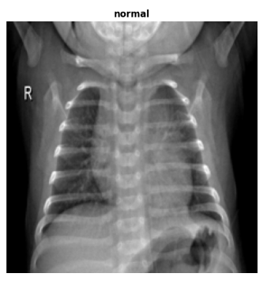
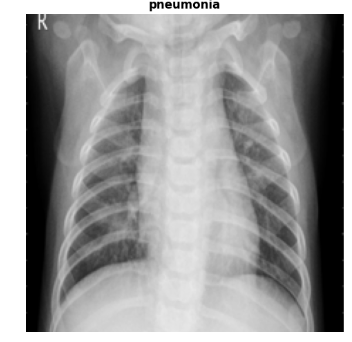
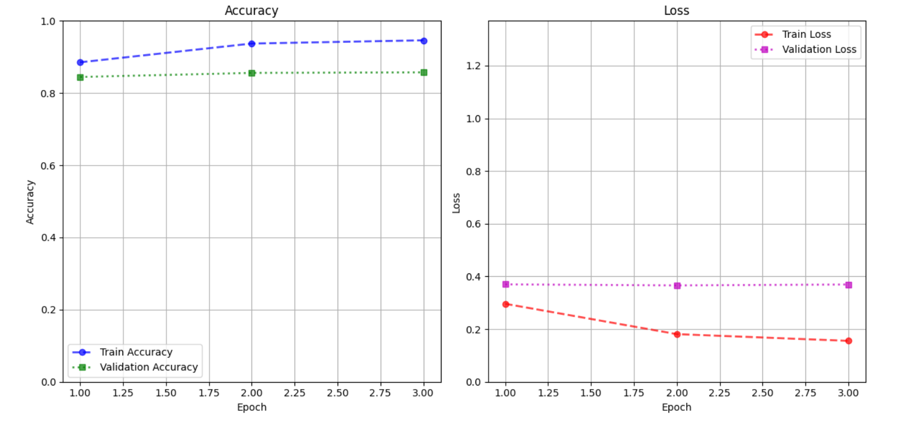
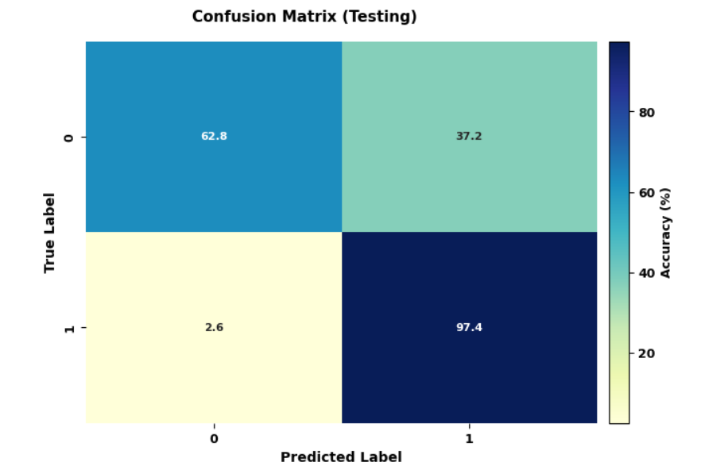

# Chest X-Ray Images (Pneumonia) Dataset

## Overview

This dataset contains chest X-ray images, used to distinguish between healthy lungs and lungs with pneumonia. The images are organized into three primary folders (`train`, `test`, `val`) with subfolders for each class: **Normal** and **Pneumonia**.

- **Source**: Images were sourced from the Guangzhou Women and Children's Medical Center and consist of chest X-rays from pediatric patients aged 1-5 years.
- **Image Quality**: All scans underwent quality control; unreadable or low-quality images were removed.
- **Annotation**: Diagnosis of each scan was performed by two expert radiologists, with a third review to ensure accuracy, especially for the evaluation set.

## Image Characteristics

- **Normal Lungs**: Clear lungs without any areas of abnormal opacification.
- **Bacterial Pneumonia**: Typically shows localized areas of lung consolidation.
- **Viral Pneumonia**: Presents a more diffuse, interstitial pattern affecting both lungs.

## Dataset Source and Citation

- **Data Link**: [Mendeley Data Repository](https://data.mendeley.com/datasets/rscbjbr9sj/2)
- **License**: CC BY 4.0
- **Research Article**: [Cell Journal](http://www.cell.com/cell/fulltext/S0092-8674(18)30154-5) - Illustrative examples and details about pneumonia and normal lung patterns in chest X-rays.

## Inspiration

This dataset supports the development of automated methods for disease detection and classification in medical images, offering potential applications in AI-assisted diagnostics for pneumonia and other respiratory diseases.

---

## 🩺 Chest X-ray Dataset: Preprocessing and Exploration

This section explains the steps for preparing and exploring chest X-ray images used in classifying pneumonia cases.

### 📂 Dataset Structure
The dataset is organized into three main directories:
- **Training** 🏋️‍♂️: Contains images used for model training.
- **Validation** 🧪: Used for tuning model parameters.
- **Testing** 📊: Contains images for evaluating model performance.

Each directory has two classes:
- **`NORMAL`** 🫁: Represents normal chest X-rays.
- **`PNEUMONIA`** 🤒: Represents X-rays with pneumonia cases.

### ⚙️ Data Preparation

1. **Class Distribution** 📊  
   Counts the number of images in each class and calculates class percentages to ensure dataset balance and gain insights into the data distribution.

2. **Generate Labels File** 📝  
   Creates text files for each dataset split (`train`, `validation`, and `test`). These files contain image paths and their respective class labels, allowing efficient batch processing and easy loading of image-label pairs during training.

### 🔄 Data Loading and Batching
Data is loaded and processed in patches using a TensorFlow Dataset generator:
- **Batch Loading** 📥: Loads images in manageable patches, avoiding memory overload.
- **Image Resizing** 🔄: Resizes images to a target size of `(224, 224)`.
- **Normalization** 🔄: Scales pixel values to the range `[0, 1]` for efficient training.

### 🖼️ Visualization
The `show_images` function displays a grid of images with their respective labels, providing a quick overview to verify dataset structure and quality.

<strong>Sample Output</strong>

  
| 🫁 **Normal** | 🤒 **Pneumonia** |
|---------------|------------------|
|  |  |

### 📊 Sample Dataset Summary
| Dataset   | Class       | Count | Percentage |
|-----------|-------------|-------|------------|
| Train     | Pneumonia   | 3875  | 74.29%     |
|           | Normal      | 1341  | 25.71%     |
| Validation| Pneumonia   | 8     | 50.00%     |
|           | Normal      | 8     | 50.00%     |
| Test      | Pneumonia   | 390   | 62.50%     |
|           | Normal      | 234   | 37.50%     |

----

# Model Training and Evaluation Summary
## Model Selection
Two pretrained models from the ImageNet dataset were utilized for binary classification of chest X-ray images: **ResNet50** and **DenseNet121**. Both models were used as feature extractors with their layers frozen to preserve learned weights, followed by a dense layer to predict two classes.

### Model Architectures
- **ResNet50**:
  - Parameters: ~23.6M
  - Trainable Params: 4,098
  - Non-trainable Params: ~23.6M

- **DenseNet121**:
  - Parameters: ~7.0M
  - Trainable Params: 2,050
  - Non-trainable Params: ~7.0M

## Training Process
Models were trained with early stopping and a patience of 3, using:
- **Batch size**: 32
- **Learning Rate**: 0.002
- **Epochs**: 3

### Best Model
After training both models, **DenseNet121** outperformed ResNet50 with a validation accuracy of 74.3%, making it the best model for further training and evaluation.

## Final Model Training
DenseNet121 was retrained on the complete dataset, achieving:
- Final Validation Accuracy: 85.7%
- Validation Loss: 0.37

## Visualizing Model Performance
Below are visualizations for training and validation accuracy and loss, demonstrating model improvements and convergence.

### Accuracy and Loss Plots
- **Accuracy Plot**: Demonstrates the training and validation accuracy per epoch.
- **Loss Plot**: Shows the decrease in training and validation loss over time.

## Confusion Matrix
The confusion matrix provides insights into classification performance across both classes, aiding in error analysis.

---
# Chest X-Ray Classification App

This application utilizes a pre-trained deep learning model to classify chest X-ray images as either **Normal** or **Pneumonia**. It is built using Streamlit, providing a user-friendly interface for image uploads and displaying prediction results.

## Functionality

1. **Model Loading**
   - The application loads a pre-trained model for chest X-ray classification. If there's an error during the loading process, an error message is displayed, and the app stops execution.

2. **Class Names**
   - The application defines class names for the prediction output: `Normal` and `Pneumonia`.

3. **Prediction Class**
   - A `Prediction` class encapsulates the prediction logic:
     - **`__init__`**: Initializes the class with the loaded model.
     - **`classify_image(image)`**: 
       - Takes an image as input.
       - Resizes the image to 512x512 pixels and normalizes pixel values.
       - Predicts the class and confidence level using the model.
       - Returns the predicted class, confidence, and class confidence levels.

4. **User Interface**
   - The app title and description are displayed using Streamlit.
   - Users can upload one or multiple chest X-ray images or provide a URL to an image.
   - Patient name input is required for associating results.

5. **Image Uploading**
   - Users can upload images directly or input an image URL. The application fetches the image from the URL and displays it.

6. **Prediction Results**
   - Once images are uploaded, users can submit them for classification.
   - The app processes each image, displays it alongside the predicted class, confidence level, and class confidence percentages.
   - The results for each image are organized and displayed for easy review.

7. **Session Management**
   - A button is provided to start a new session, which clears the images and resets the app.
----
## Additional Information
- The model is trained to differentiate between normal and pneumonia-affected chest X-rays.
- Confidence levels for each prediction are displayed as a percentage.

